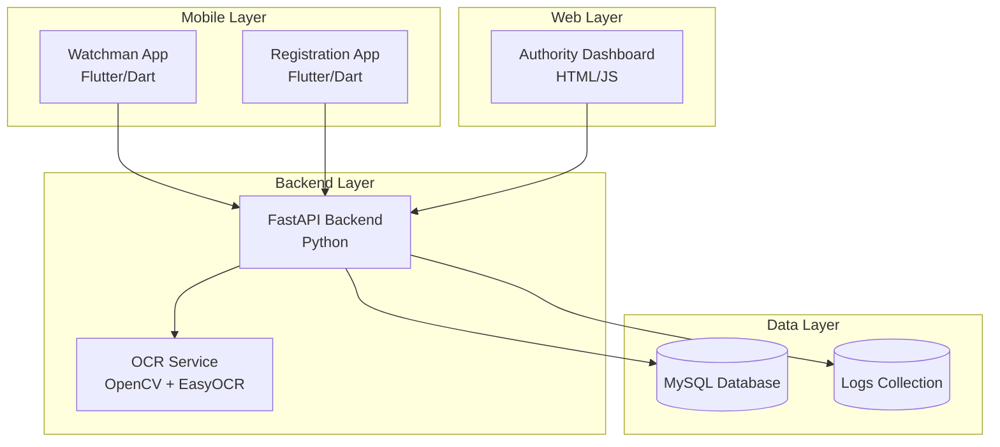

# Design Document

## Overview

The Smart Campus Access Control system is designed as a distributed architecture with three main components: a Flutter mobile application for watchmen, a Python FastAPI backend with OCR capabilities, and a web dashboard for authorities. The system uses MySQL for data persistence and implements real-time communication for security alerts. The architecture prioritizes rapid development for hackathon delivery while maintaining clean separation of concerns.

## Architecture

### System Architecture Diagram



### Technology Stack

- **Mobile Frontend**: Flutter/Dart with HTTP client for API communication
- **Web Frontend**: HTML5/CSS3/JavaScript with fetch API
- **Backend**: Python FastAPI with async support
- **OCR Processing**: OpenCV for video processing, EasyOCR for text extraction
- **Database**: MySQL with structured tables for users, vehicles, and logs
- **Communication**: REST APIs with JSON payloads

## Components and Interfaces

### 1. Flutter Mobile Application

#### Watchman Interface
- **Main Screen**: Clean UI with prominent "Scan ID" button
- **Scan Screen**: Camera integration for QR/barcode scanning with manual input fallback
- **Result Screen**: Large visual indicators (green/red) with clear text feedback
- **Alert System**: Push notifications for system alerts

#### Registration Interface
- **Vehicle Registration Form**: Input fields for license plate, vehicle type, owner ID
- **Confirmation Screen**: Success/error feedback with registration details

#### Key Flutter Components
```dart
// Main screens
- ScanScreen: Camera integration and manual input
- ResultScreen: Access decision display
- RegistrationScreen: Vehicle registration form
- AlertsScreen: Notification history

// Services
- ApiService: HTTP client for backend communication
- DatabaseHelper: Local SQLite for offline caching
- NotificationService: Push notification handling
```

### 2. FastAPI Backend

#### Core Endpoints
```python
# ID Verification
POST /verify_id
{
  "id_number": "string",
  "scan_method": "qr|barcode|manual"
}

# Vehicle Processing
POST /upload_video
{
  "video_file": "multipart/form-data",
  "gate_id": "string"
}

# Registration
POST /register_vehicle
{
  "license_plate": "string",
  "owner_id": "string",
  "vehicle_type": "string"
}

# Logs and Monitoring
GET /logs?limit=50&offset=0
GET /alerts/recent
```

#### Service Architecture
```python
# Core services
- AuthService: ID verification logic
- VehicleService: License plate processing
- OCRService: Video processing and text extraction
- LoggingService: Audit trail management
- AlertService: Real-time notification system
```

### 3. OCR Processing Service

#### Video Processing Pipeline
1. **Video Input**: Accept MP4/AVI formats up to 10MB
2. **Frame Extraction**: Extract key frames using OpenCV
3. **Preprocessing**: Image enhancement for better OCR accuracy
4. **Text Extraction**: EasyOCR for license plate recognition
5. **Validation**: Pattern matching for license plate formats
6. **Database Lookup**: Match extracted text against vehicle registry

#### OCR Configuration
```python
# OpenCV settings
- Frame sampling: Every 30 frames
- Image preprocessing: Gaussian blur, contrast enhancement
- ROI detection: License plate region identification

# EasyOCR settings
- Languages: ['en']
- GPU acceleration: Enabled if available
- Confidence threshold: 0.7
```

### 4. Web Dashboard

#### Authority Interface Layout
```html
<!-- Two-section layout -->
<div class="dashboard-container">
  <section class="video-upload">
    <!-- Video upload with drag-and-drop -->
    <!-- Processing status indicator -->
    <!-- Result display area -->
  </section>
  
  <section class="logs-monitoring">
    <!-- Real-time alerts feed -->
    <!-- Access logs table with filtering -->
    <!-- Statistics dashboard -->
  </section>
</div>
```

#### JavaScript Functionality
- **File Upload**: Drag-and-drop with progress tracking
- **Real-time Updates**: WebSocket or polling for live alerts
- **Data Visualization**: Charts for access statistics
- **Filtering**: Date range, access type, result status

## Data Models

### MySQL Database Schema

#### Users Table
```sql
CREATE TABLE users (
    id VARCHAR(20) PRIMARY KEY,
    name VARCHAR(100) NOT NULL,
    email VARCHAR(100),
    role ENUM('student', 'staff', 'faculty'),
    department VARCHAR(50),
    status ENUM('active', 'inactive') DEFAULT 'active',
    created_at TIMESTAMP DEFAULT CURRENT_TIMESTAMP
);
```

#### Vehicles Table
```sql
CREATE TABLE vehicles (
    license_plate VARCHAR(20) PRIMARY KEY,
    owner_id VARCHAR(20),
    vehicle_type ENUM('car', 'motorcycle', 'bicycle'),
    color VARCHAR(30),
    model VARCHAR(50),
    status ENUM('active', 'inactive') DEFAULT 'active',
    registered_at TIMESTAMP DEFAULT CURRENT_TIMESTAMP,
    FOREIGN KEY (owner_id) REFERENCES users(id)
);
```

#### Access Logs Table
```sql
CREATE TABLE access_logs (
    id INT AUTO_INCREMENT PRIMARY KEY,
    timestamp TIMESTAMP DEFAULT CURRENT_TIMESTAMP,
    gate_id VARCHAR(10),
    user_id VARCHAR(20),
    license_plate VARCHAR(20),
    verification_method ENUM('id_only', 'vehicle_only', 'both'),
    access_granted BOOLEAN,
    alert_triggered BOOLEAN DEFAULT FALSE,
    notes TEXT,
    INDEX idx_timestamp (timestamp),
    INDEX idx_user_id (user_id),
    INDEX idx_license_plate (license_plate)
);
```

### Mock Data Structure
```sql
-- 10 Sample Users
INSERT INTO users VALUES 
('STU001', 'John Doe', 'john@university.edu', 'student', 'Computer Science', 'active'),
('STF001', 'Jane Smith', 'jane@university.edu', 'staff', 'Administration', 'active'),
-- ... 8 more entries

-- 10 Sample Vehicles
INSERT INTO vehicles VALUES 
('ABC123', 'STU001', 'car', 'Blue', 'Honda Civic', 'active'),
('XYZ789', 'STF001', 'car', 'Red', 'Toyota Camry', 'active'),
-- ... 8 more entries
```

## Error Handling

### API Error Responses
```json
{
  "error": true,
  "message": "User-friendly error message",
  "code": "ERROR_CODE",
  "details": "Technical details for debugging",
  "timestamp": "2025-01-04T10:30:00Z"
}
```

### Error Categories
1. **Validation Errors**: Invalid input format, missing required fields
2. **Authentication Errors**: Invalid credentials, expired tokens
3. **Processing Errors**: OCR failures, video format issues
4. **Database Errors**: Connection failures, constraint violations
5. **Network Errors**: Timeout, connection refused

### Flutter Error Handling
- **Network Errors**: Offline mode with local caching
- **Camera Errors**: Fallback to manual input
- **Validation Errors**: Real-time form validation with clear messages
- **API Errors**: User-friendly error dialogs with retry options

### Backend Error Handling
- **Database Failures**: Connection pooling with retry logic
- **OCR Failures**: Graceful degradation with manual verification option
- **File Upload Errors**: Size and format validation with clear feedback
- **Rate Limiting**: Request throttling to prevent abuse

## Testing Strategy

### Unit Testing
- **Backend**: pytest for API endpoints, service layer, and database operations
- **Flutter**: widget tests for UI components and unit tests for business logic
- **OCR Service**: Test with sample images and videos for accuracy validation

### Integration Testing
- **API Integration**: Test complete request/response cycles
- **Database Integration**: Test CRUD operations and data consistency
- **OCR Pipeline**: End-to-end video processing validation

### Manual Testing Scenarios
1. **Happy Path**: Successful ID verification and vehicle recognition
2. **Error Cases**: Invalid IDs, unrecognized license plates, network failures
3. **Edge Cases**: Poor video quality, multiple vehicles in frame, damaged QR codes
4. **Performance**: Response times under load, concurrent user access

### Demo Preparation
- **Sample Data**: Pre-loaded with realistic test data
- **Test Scenarios**: Scripted demo flow with expected outcomes
- **Fallback Plans**: Manual input options if scanning fails during demo
- **Performance Optimization**: Caching and preloading for smooth demonstration

### Deployment Strategy
- **Backend**: Docker containerization for easy deployment
- **Database**: MySQL with initialization scripts for mock data
- **Frontend**: Flutter APK build for Android devices
- **Web Dashboard**: Static hosting with API proxy configuration